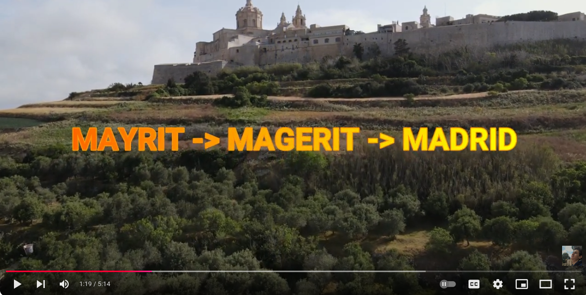
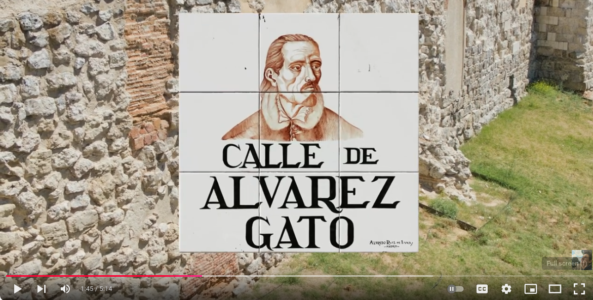

# 2024-11-04 <!-- markmap: foldAll -->

## English
- Present Simple [Exercises](https://www.bbc.co.uk/learningenglish/english/course/lower-intermediate/unit-2/session-2)
- Leisure Activities, [continuation](https://my-andrea.github.io/school_subjects/English/2024/October/week_05/2024-10-29/2024-10-29.html)
## Religión
- La **Virgen de la Almudena**, la historia y la leyenda.
- 
- Sobre el origen del [nombre de Madrid](https://youtube.com/shorts/GSDUGFWFLkI?si=JoFOLWWV_4k9vCEw). 
- (Hugi) Alvarez, [**Gato**?](https://youtu.be/fFLznALheik?si=v-TKa16y_iWIY-iy&t=66) **~~`**
- 
## Lengua_Literatura
- Ejercicio de Narración (mi biopic) Terminado y Entregado [✓]
## Maths
- Corregir Ejercicios **MMC**, **MDC**
## Geo_Historia
- Completar un Test [?]
- Para mis notas 
