# 2024-11-05 <!-- markmap: foldAll -->

## Religión
- 
- 
- Manos a la Obra Ayuda a los Damnificados de la Catástrofe de Valencia
## Biology
- 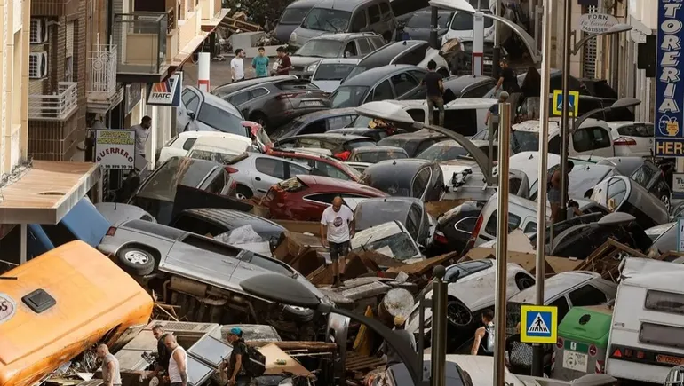
- 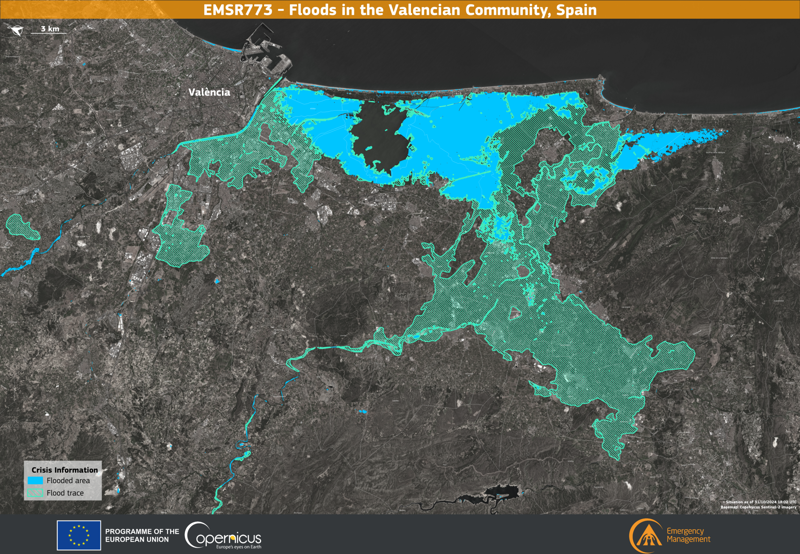
- 
- 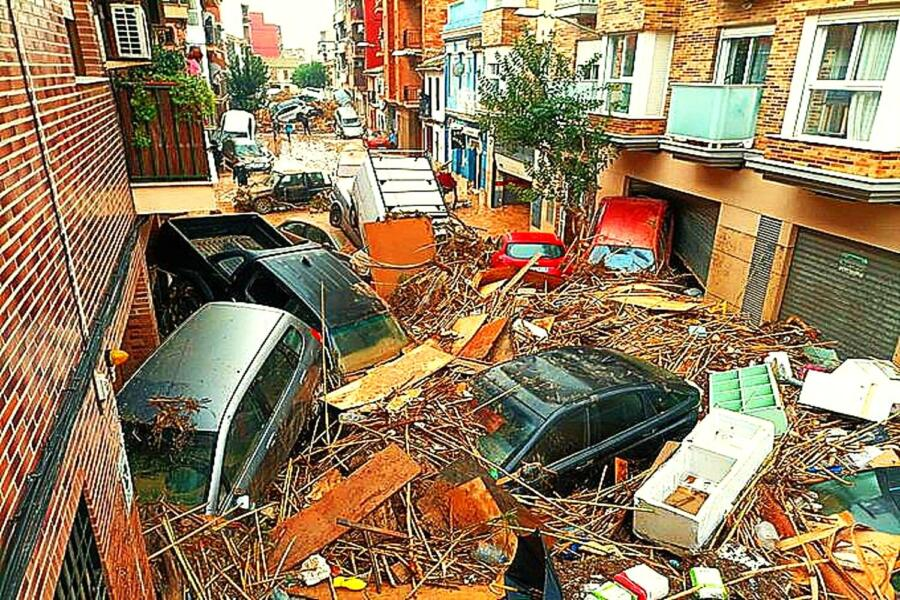
- 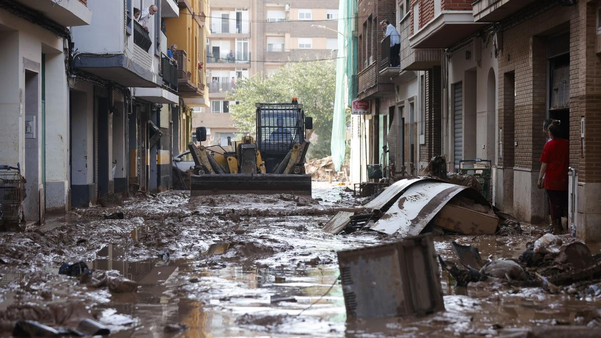
- 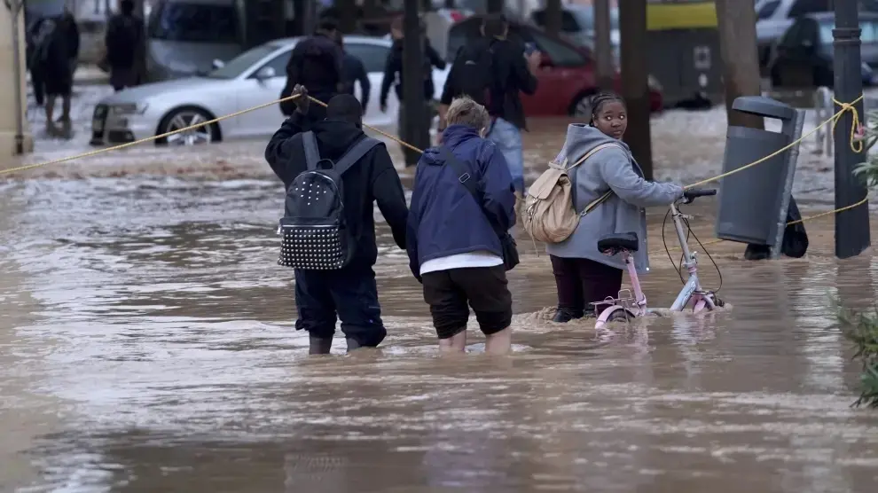
- 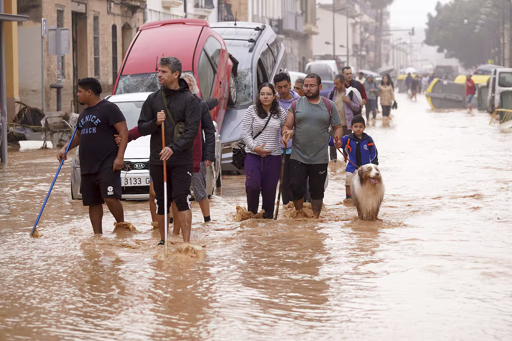
- 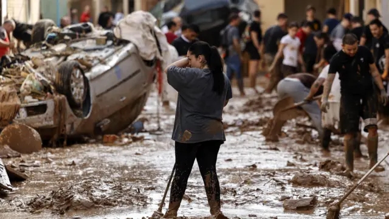
- 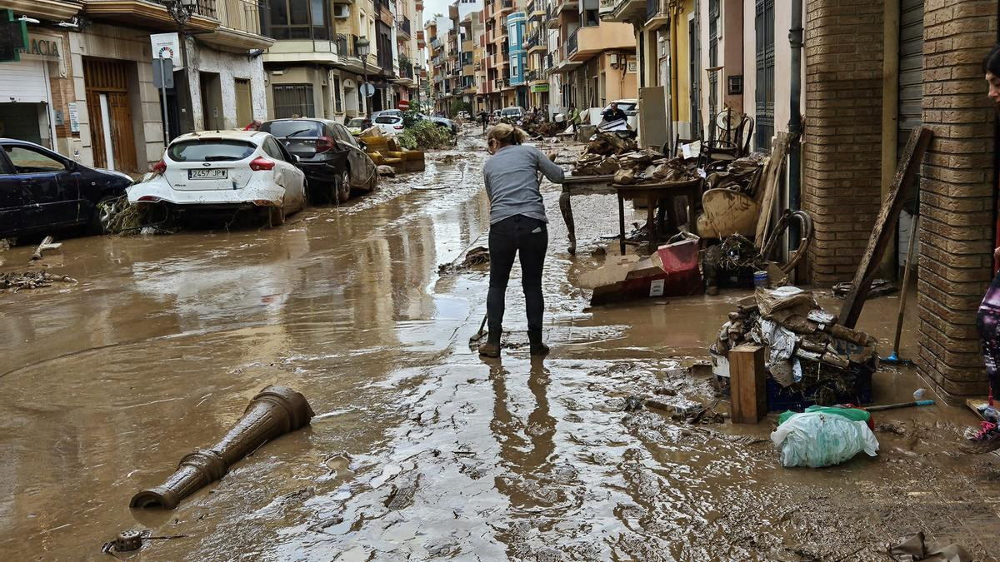
- 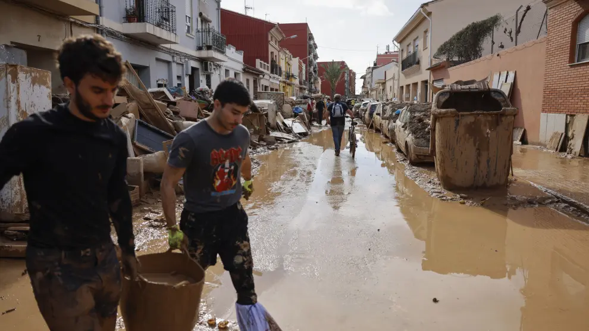
- 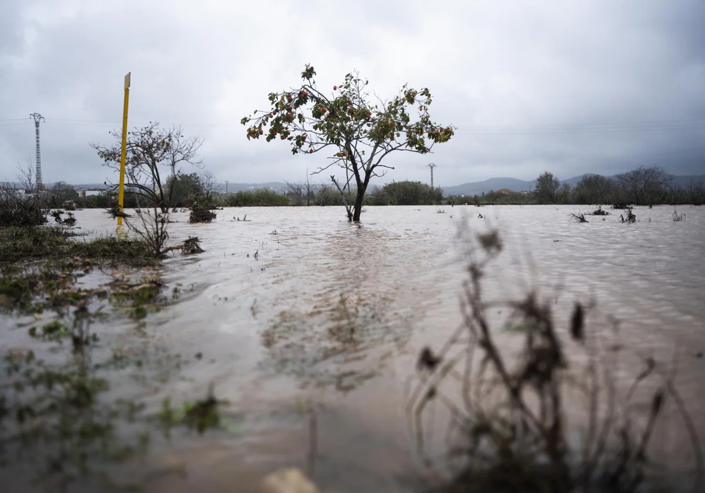
- 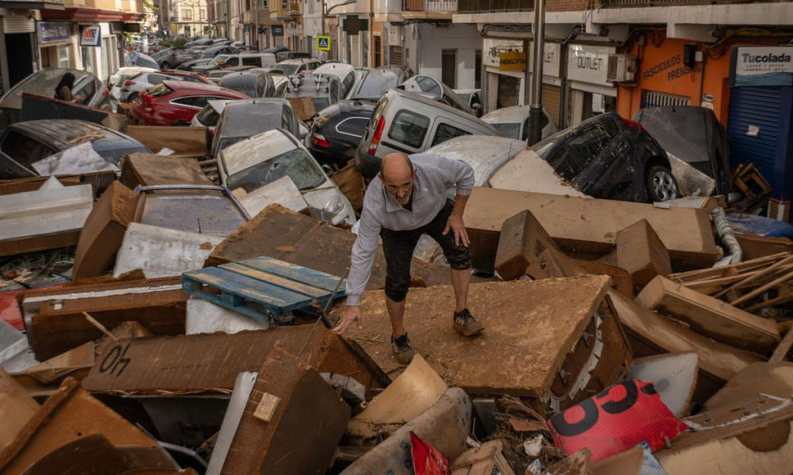
- 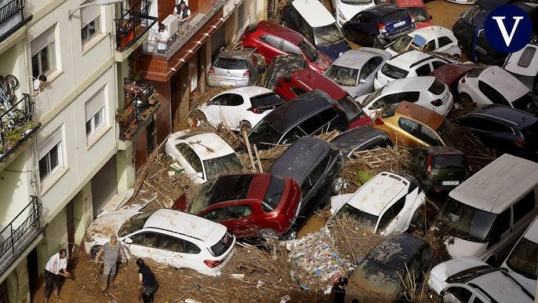
- 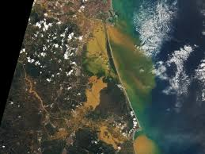
- 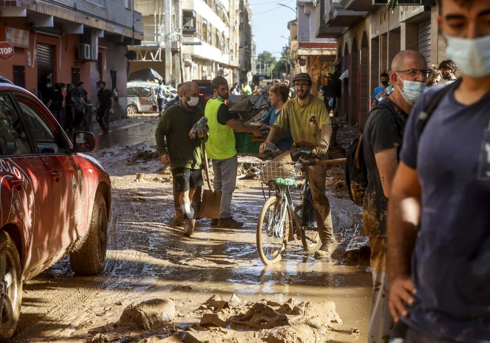
## Artes_Plásticas
- Preparando el Test,
  - Materiales
  - Lluvia de Ideas
    - Tipo Collage
## English
- Intro to **Chapter 3** School things 
## Geo_Historia
- Revisando el test [**6.4**] ✓
- To Do: Volver por los fallos (por completar)
## Maths
- Más Ejercicios de **MMC** y **MDC**

