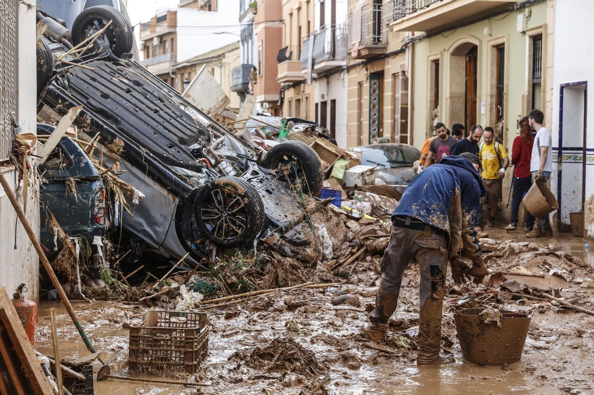

# 2024-11-05 <!-- markmap: foldAll -->

## Religión
- 
- 
- Manos a la Obra, Ayuda a los Damnificados de la Catástrofe de Valencia
## Biology
- 217 muertos contabilizados 
- Áreas afectadas, en azul 
- Consecuencias de la peor Dana del Siglo  
- Dana torrent 
- Dana terrible  
- Doce horas que desembocaron en catástrofe, Valencia despierta tras una noche infernal 
- España, inundaciones Valencia, atender el cambio climático 
- Paiporta, el epicentro 
- Prioridades salud pública  
- Situación en Valencia tras las inundaciones causadas por la Dana 
- Una tromba como 4 veces el ebro 
- Un hombre camina por una calle de Utiel cubierta de escombros 
- Valencia desvastada  
- Vista desde el espacio  
- Voluntarios Dana 
## Artes_Plásticas
- Preparando el **Test**,
  - Materiales: (...) 
  - Lluvia de Ideas
    - Tipo **Collage**
## English
- Intro to **Chapter 3** [School things](https://www.bbc.co.uk/learningenglish/english/course/emw/unit-1/session-1) 
## Geo_Historia
- Revisando el test [**6.4**] ✓
- To Do: Volver por los fallos (por completar)
## Maths
- Más ejercicios de **MMC** y **MDC**

