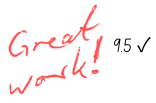

# 2024-10-17 <!-- markmap: foldAll -->

## Biología
 - repasar un poco (sobre qué?)
 - video sobre qué (los reinos de la naturaleza)
## Música 
 - [Ritmos Corporales](https://my-andrea.github.io/school_subjects/M%C3%BAsica/2024/October/week_03/2024-10-16/2024-10-16.html) (la antigua técnica del chasquido)
## Mates
 - **Examen** (expected:==BB=BastanteBien Hurra== [?]) 
## Lengua
 - Leer (sobre qué)
## Computación
 - Diagramas de Flujo
 - La metáfora de la receta 
## English
 - Ejercicios en ==Present Simple==
