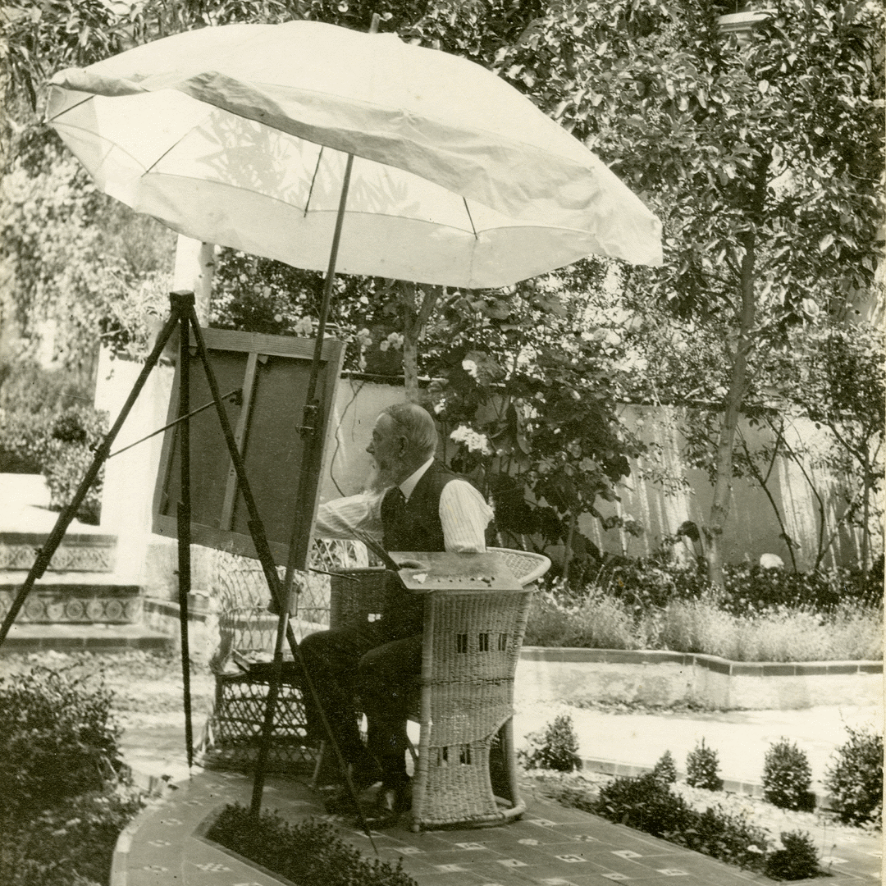
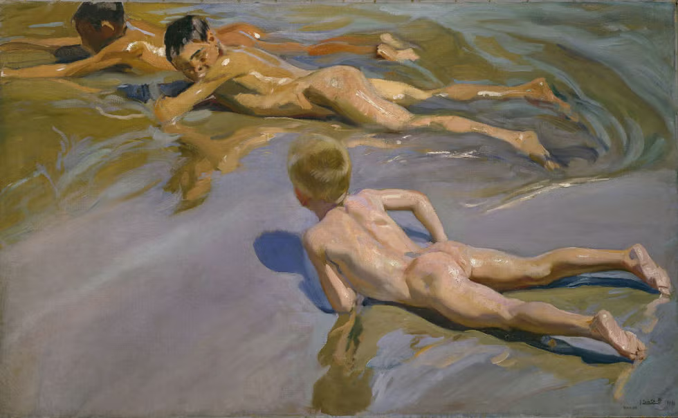
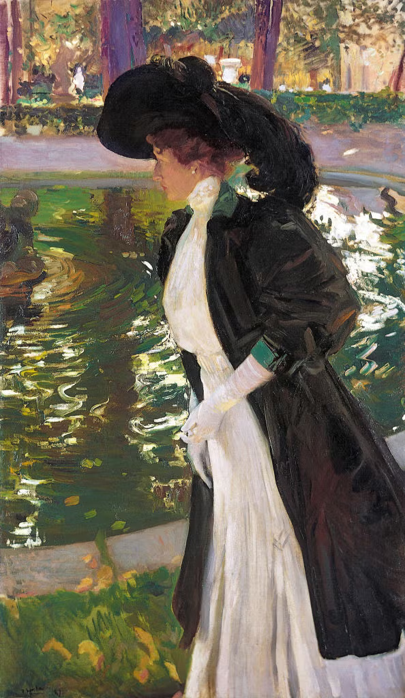
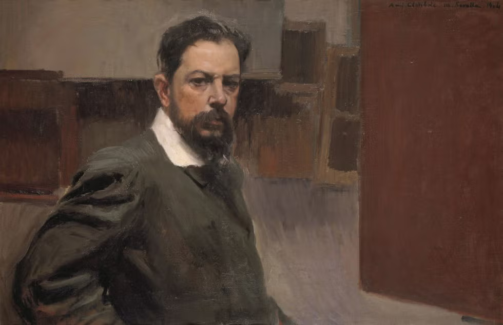
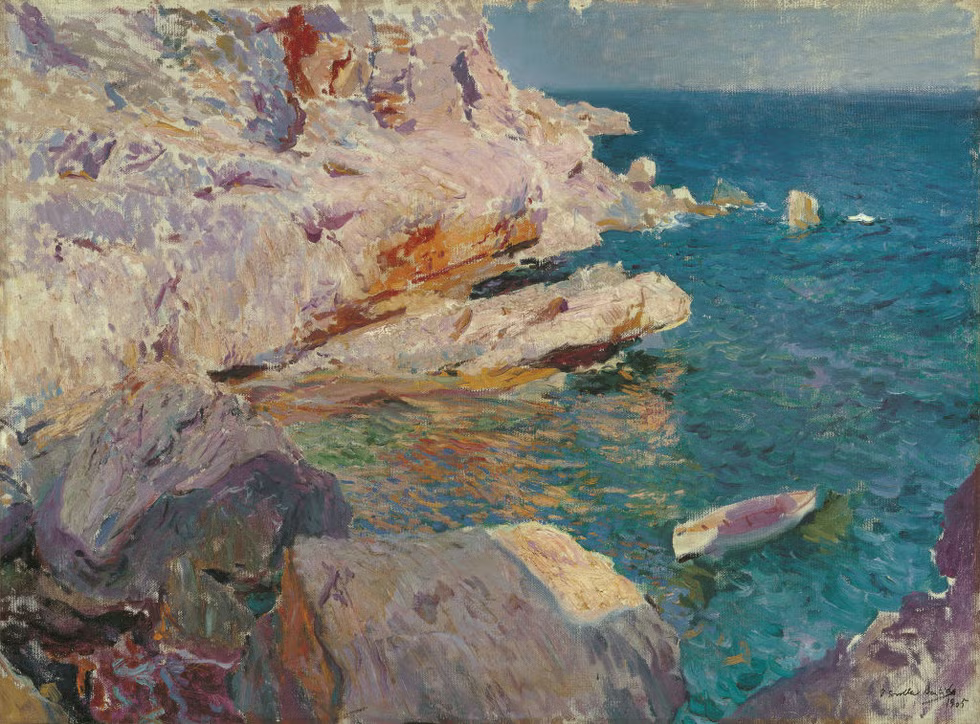
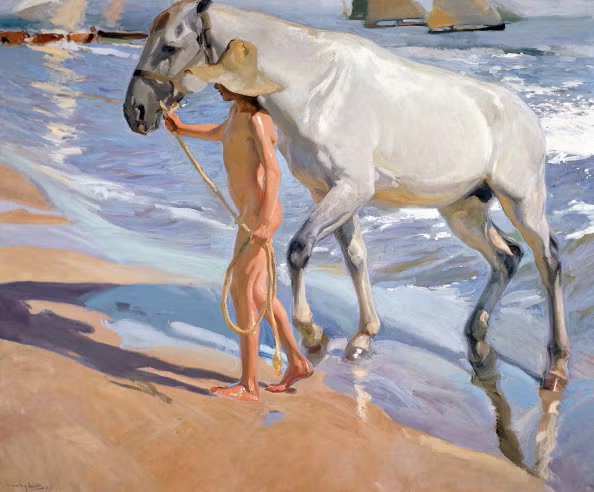
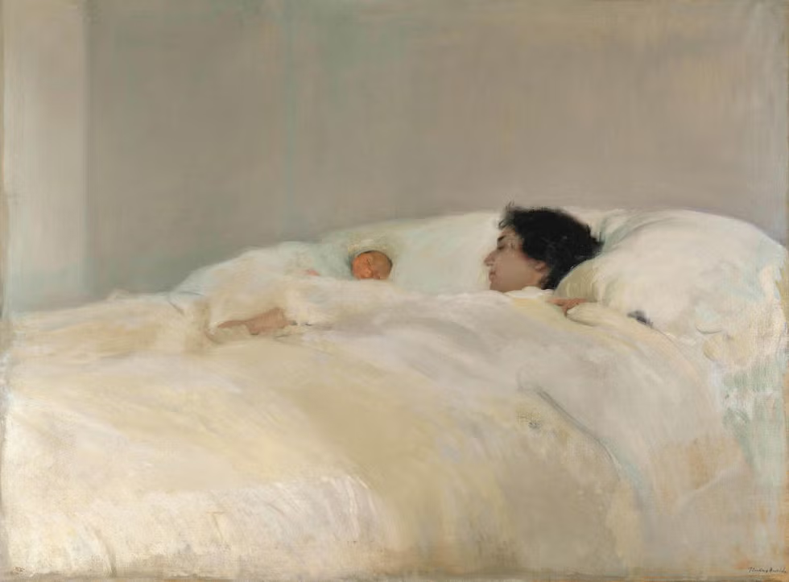
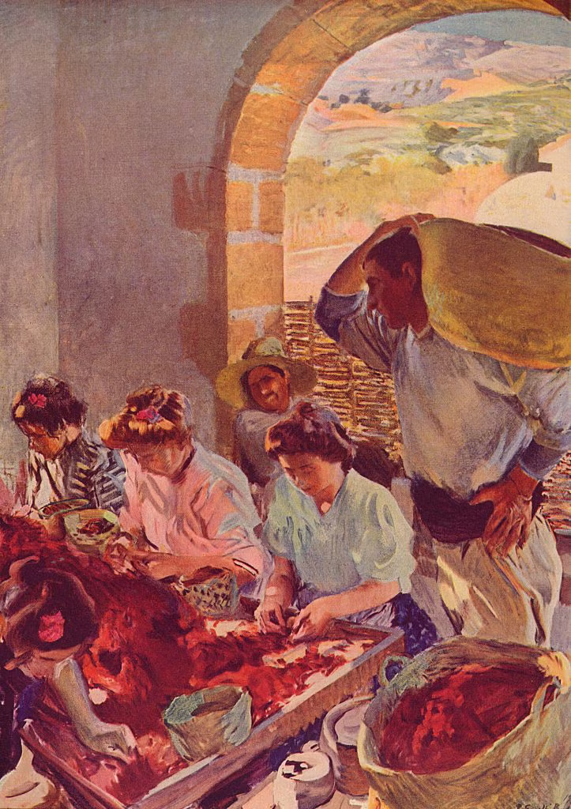
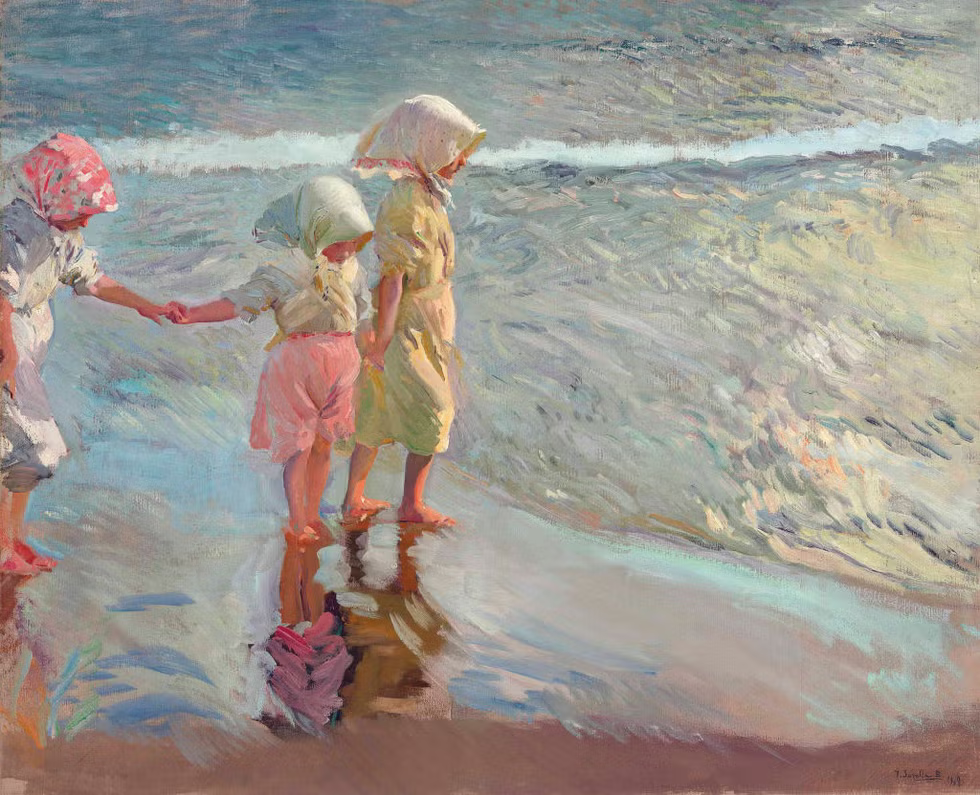
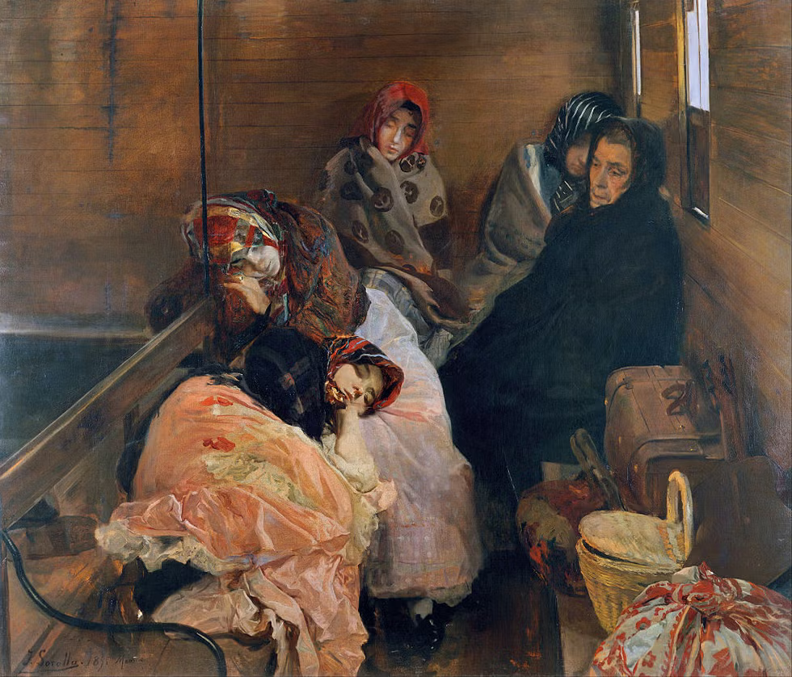

# [2024-10-29](2024-10-29.html) <!-- markmap: foldAll -->

## [Joaquín Sorolla](https://es.wikipedia.org/wiki/Joaqu%C3%ADn_Sorolla) (1863-1923) 
- fue un destacado pintor español conocido por su habilidad para capturar la luz mediterránea.
- Joaquin Sorolla pintando en el jardín de su casa 
## Etapas de su Obra

### **Etapa de formación (1863-1888):**
- Obras notables: *Estudio de pies* (1876-79),
- *El padre Jofré defendiendo a un loco* (1887)

### **Etapa de consolidación (1889-1899):**
- Obras notables: *Otra Margarita* (1892),
- *Triste herencia* (1899)

### **Etapa de culminación (1900-1910):**
- Obras notables: *Paseo a orillas del mar* (1909),
- *Chicos en la playa* (1909)

### **Etapa final (1911-1920):**
- Obras notables: *Visión de España* (1911-1919),
- *Jardín de la Casa Sorolla* (1918-1920) 

### Una breve galería
- 9 Chicos en la playa (1909) 
- 6 Clotilde paseando en los Jardines de La Granja (1907) 
- 4 Autorretrato (1904) 
- 8 Paseos a orillas del mar (1909) 
- 5 Rocas de Jávea y el bote blanco (1905) 
- 10 El baño del caballo (1909) 
- 3 La madre (1895-1900) 

- 1 Preparación de la uva seca (1890) 
- 7 Las tres hermanas en la playa (1908) 
- 2 Trata de blancas (1895) 
